# Cityscapes vs GTA-5 Dataset Comparison

In this report we present metrics for the DAFormer model trained with GTA-5 (source) and evaluated on Cityscapes (target). The metrics presented were obtained by evaluating the trained model on the Cityscapes validation set (3 cities, 500 images) and on a 500-image subset of GTA-5.

## View Examples

The following images are examples of the Cityscapes and GTA datasets, to show the look and field of both datasets.

| Cityscapes | GTA-5 |
|-----------|-----------|
| 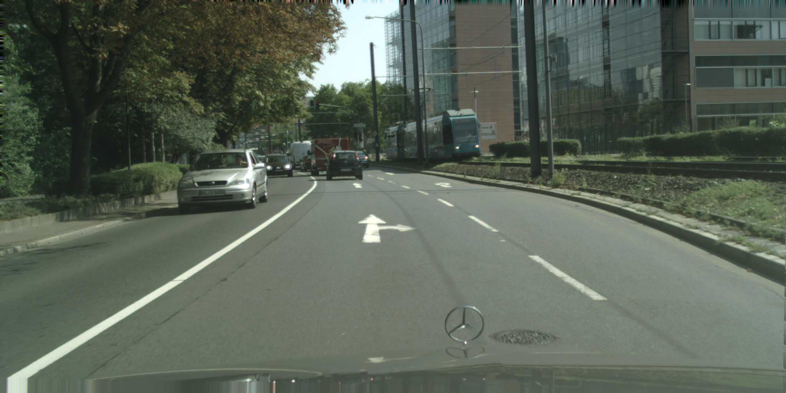 | 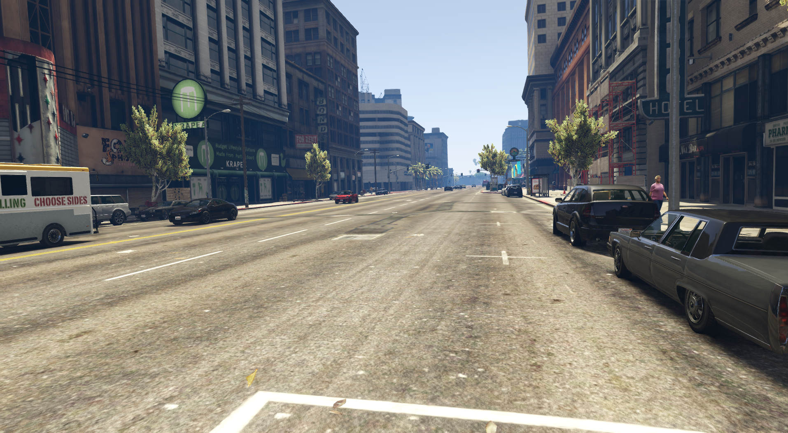 |
|  | 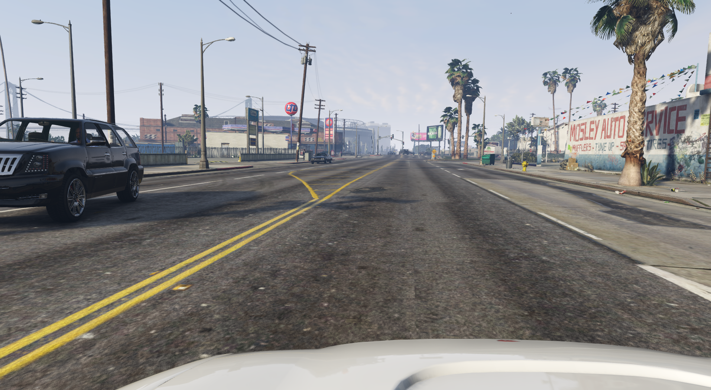 |  

## Whole-Image Statistics
The following metrics show the mIoU and error when evaluating the Cityscapes validation set and the GTA-5 subset. The mIoU shows an approximate 10% gap, while the average error shows a gap of about 1.2%.

Definitions:
- mIoU: For calculating the mIoU, pixels are aggregated across all images and IoU is computed over all pixels combined.
- Average Global Error: the mean per-image pixel error (excluding ignored pixels).

| Metric | Cityscapes | GTA-5 |
|---|---:|---:|
| mIoU | 68.85% | 78.89% |
| Average Global Error | 5.95% | 4.75% |

### 4x4 Grid Analysis

The image is divided into a 4x4 grid. The plot below shows the error for each cell across the 500 images from Cityscapes and GTA-5.

Both domains show a similar error distribution: the top row has higher errors (distant objects and higher class diversity), while the lower rows—especially the third row from the bottom—have fewer errors because the area in front of the vehicle is usually road.

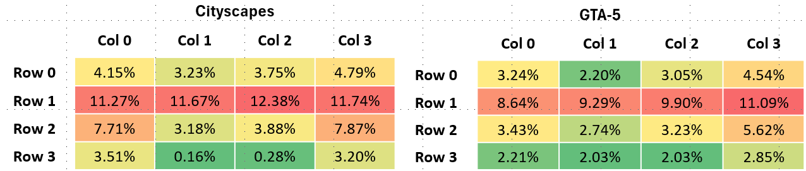

<!-- | Cityscpes | Synthia |
|-----------|-----------|
|  |  |
 -->

### 4x4 Grid by Class: Spatial Error Distribution by Representation (Top 5)

The following tables show the top 5 most represented classes (with their errors) for each cell of the grid for Cityscapes and GTA-5.

|  Cityscapes  | Col 0 | Col 1 | Col 2 | Col 3 |
|:---:|:---:|:---:|:---:|:---:|
| Row 0 | Building (50.82%) (Err: 4.17%) Vegetation (37.83%) (Err: 2.56%) Sky (6.68%) (Err: 0.97%) Pole (1.70%) (Err: 30.92%) Traffic sign (1.00%) (Err: 16.21%) | Vegetation (39.95%) (Err: 2.71%) Building (36.90%) (Err: 3.49%) Sky (20.66%) (Err: 0.86%) Pole (1.08%) (Err: 39.34%) Traffic sign (0.45%) (Err: 19.80%) | Vegetation (40.20%) (Err: 2.39%) Building (40.13%) (Err: 3.74%) Sky (16.49%) (Err: 1.33%) Pole (1.33%) (Err: 41.24%) Traffic sign (1.00%) (Err: 16.99%) | Building (56.15%) (Err: 3.84%) Vegetation (34.38%) (Err: 2.46%) Sky (3.24%) (Err: 1.83%) Traffic sign (2.34%) (Err: 16.08%) Pole (1.91%) (Err: 36.55%) |
| Row 1 | Building (38.91%) (Err: 6.38%) Vegetation (23.43%) (Err: 5.80%) Car (15.56%) (Err: 4.31%) Pole (3.29%) (Err: 34.63%) Person (3.05%) (Err: 19.27%) | Building (29.84%) (Err: 6.93%) Vegetation (27.04%) (Err: 5.17%) Car (14.23%) (Err: 6.19%) Road (8.67%) (Err: 2.90%) Person (3.67%) (Err: 18.21%) | Building (29.47%) (Err: 7.35%) Vegetation (25.84%) (Err: 5.25%) Car (14.29%) (Err: 6.03%) Road (8.52%) (Err: 3.35%) Person (4.22%) (Err: 16.66%) | Building (37.92%) (Err: 6.23%) Vegetation (21.38%) (Err: 5.39%) Car (15.07%) (Err: 4.62%) Fence (4.28%) (Err: 30.82%) Person (4.01%) (Err: 17.16%) |
| Row 2 | Road (56.97%) (Err: 1.63%) Sidewalk (14.26%) (Err: 18.49%) Car (13.34%) (Err: 2.63%) Vegetation (2.94%) (Err: 8.80%) Building (2.66%) (Err: 10.84%) | Road (85.71%) (Err: 0.39%) Sidewalk (4.99%) (Err: 24.35%) Car (3.96%) (Err: 5.78%) Person (1.12%) (Err: 8.73%) Vegetation (0.92%) (Err: 16.58%) | Road (83.23%) (Err: 0.42%) Sidewalk (7.79%) (Err: 19.71%) Car (3.96%) (Err: 4.58%) Person (1.10%) (Err: 9.33%) Terrain (0.94%) (Err: 55.33%) | Road (42.35%) (Err: 2.03%) Sidewalk (27.72%) (Err: 11.98%) Car (13.55%) (Err: 2.14%) Building (3.44%) (Err: 8.32%) Terrain (3.33%) (Err: 38.62%) |
| Row 3 | Road (91.40%) (Err: 0.51%) Sidewalk (4.54%) (Err: 18.41%) Car (1.80%) (Err: 4.68%) Terrain (1.01%) (Err: 62.13%) Vegetation (0.44%) (Err: 29.97%) | Road (99.42%) (Err: 0.04%) Sidewalk (0.52%) (Err: 18.00%) Person (0.04%) (Err: 3.30%) Terrain (0.01%) (Err: 100.00%) Car (0.01%) (Err: 5.77%) | Road (99.43%) (Err: 0.03%) Sidewalk (0.43%) (Err: 47.99%) Car (0.08%) (Err: 22.59%) Person (0.06%) (Err: 2.12%) Terrain (0.01%) (Err: 62.81%) | Road (83.64%) (Err: 0.35%) Sidewalk (12.52%) (Err: 15.86%) Car (1.63%) (Err: 6.14%) Terrain (1.48%) (Err: 45.99%) Vegetation (0.39%) (Err: 22.56%) |

Cityscapes Analysis: The model achieves low error on large, texturally uniform "stuff" classes such as Building, Vegetation, Sky, and Road. The top rows are dominated by Building and Vegetation, while the bottom rows are dominated by Road, which matches the expected camera perspective in street scenes. A notable exception is Sidewalk: even though it is well represented, it keeps a relatively high error in the lower rows, suggesting confusion with Road near the ego-vehicle region.

|  GTA-5   | Col 0 | Col 1 | Col 2 | Col 3 |
|:---:|:---:|:---:|:---:|:---:|
| Row 0 | Sky (46.15%) (Err: 1.41%) Building (33.60%) (Err: 2.02%) Vegetation (13.07%) (Err: 5.09%) Truck (2.08%) (Err: 5.79%) Pole (1.38%) (Err: 19.36%) | Sky (64.08%) (Err: 1.06%) Building (21.44%) (Err: 2.27%) Vegetation (10.28%) (Err: 4.61%) Pole (1.08%) (Err: 23.76%) Truck (0.98%) (Err: 1.11%) | Sky (57.00%) (Err: 1.63%) Building (25.55%) (Err: 2.49%) Vegetation (12.87%) (Err: 5.66%) Pole (1.56%) (Err: 26.43%) Truck (0.66%) (Err: 1.34%) | Building (40.99%) (Err: 2.71%) Sky (36.63%) (Err: 2.43%) Vegetation (14.65%) (Err: 6.07%) Pole (2.16%) (Err: 26.63%) Terrain (1.30%) (Err: 7.47%) |
| Row 1 | Building (37.26%) (Err: 4.63%) Vegetation (18.04%) (Err: 7.62%) Road (8.78%) (Err: 6.35%) Sky (8.11%) (Err: 3.83%) Wall (5.26%) (Err: 20.66%) | Building (29.49%) (Err: 6.32%) Road (17.09%) (Err: 3.81%) Vegetation (15.74%) (Err: 9.61%) Sky (13.73%) (Err: 3.50%) Car (5.52%) (Err: 4.68%) | Building (30.79%) (Err: 6.33%) Vegetation (15.51%) (Err: 10.34%) Road (14.35%) (Err: 6.32%) Sky (11.02%) (Err: 3.91%) Car (6.97%) (Err: 4.51%) | Building (37.18%) (Err: 6.00%) Vegetation (15.18%) (Err: 10.39%) Sidewalk (7.21%) (Err: 12.44%) Sky (6.78%) (Err: 4.77%) Road (6.46%) (Err: 13.56%) |
| Row 2 | Road (66.79%) (Err: 0.95%) Sidewalk (8.42%) (Err: 7.55%) Building (5.57%) (Err: 4.58%) Terrain (4.77%) (Err: 9.33%) Car (4.55%) (Err: 2.21%) | Road (73.23%) (Err: 0.81%) Sidewalk (10.59%) (Err: 4.35%) Car (4.27%) (Err: 1.78%) Building (3.34%) (Err: 10.55%) Vegetation (2.47%) (Err: 9.75%) | Road (67.99%) (Err: 1.17%) Sidewalk (14.27%) (Err: 4.64%) Car (7.19%) (Err: 1.56%) Building (3.49%) (Err: 6.80%) Vegetation (2.18%) (Err: 12.11%) | Road (53.29%) (Err: 2.57%) Sidewalk (22.41%) (Err: 6.97%) Building (5.82%) (Err: 7.30%) Car (4.95%) (Err: 5.08%) Terrain (3.87%) (Err: 14.52%) |
| Row 3 | Road (78.61%) (Err: 0.68%) Sidewalk (13.43%) (Err: 5.21%) Terrain (2.70%) (Err: 16.49%) Car (1.27%) (Err: 0.88%) Building (1.06%) (Err: 23.72%) | Road (71.56%) (Err: 1.92%) Sidewalk (24.01%) (Err: 1.26%) Terrain (2.00%) (Err: 14.94%) Car (1.12%) (Err: 3.57%) Vegetation (0.49%) (Err: 55.49%) | Road (65.72%) (Err: 2.60%) Sidewalk (29.55%) (Err: 1.92%) Car (1.97%) (Err: 2.81%) Terrain (1.79%) (Err: 16.95%) Vegetation (0.42%) (Err: 43.05%) | Road (65.10%) (Err: 2.28%) Sidewalk (25.16%) (Err: 3.83%) Terrain (3.54%) (Err: 3.63%) Car (1.52%) (Err: 4.32%) Wall (1.29%) (Err: 29.98%) |

GTA-5 Analysis: The same low-error trend appears for the dominant stuff classes, but the spatial composition is different from Cityscapes. Sky is more prevalent in the top row, indicating that GTA-5 has more open-sky coverage in distant regions. As in Cityscapes, Road and Sidewalk dominate the lower rows, but Sidewalk is handled more cleanly here, with consistently lower errors than in Cityscapes.

### 4x4 Grid by Class: Error Distribution by Spatial Region (Filtered by Representation > 0.5%) (Top 5)

The following tables show the top 5 classes with the highest errors for each cell of the grid for Cityscapes and GTA-5. We set a minimum representation threshold of 0.5% to filter noisy, extremely rare classes (e.g., very small counts of Person in distant grid cells).

|  Cityscapes | Col 0 | Col 1 | Col 2 | Col 3 |
|:---:|:---:|:---:|:---:|:---:|
| Row 0 | Pole (1.70%) (Err: 30.92%) Traffic sign (1.00%) (Err: 16.21%) Building (50.82%) (Err: 4.17%) Vegetation (37.83%) (Err: 2.56%) Sky (6.68%) (Err: 0.97%) | Pole (1.08%) (Err: 39.34%) Building (36.90%) (Err: 3.49%) Vegetation (39.95%) (Err: 2.71%) Sky (20.66%) (Err: 0.86%) | Pole (1.33%) (Err: 41.24%) Traffic sign (1.00%) (Err: 16.99%) Building (40.13%) (Err: 3.74%) Vegetation (40.20%) (Err: 2.39%) Sky (16.49%) (Err: 1.33%) | Fence (0.58%) (Err: 61.30%) Pole (1.91%) (Err: 36.55%) Traffic sign (2.34%) (Err: 16.08%) Traffic light (0.58%) (Err: 13.16%) Building (56.15%) (Err: 3.84%) |
| Row 1 | Terrain (1.08%) (Err: 55.09%) Fence (2.52%) (Err: 51.45%) Sidewalk (2.35%) (Err: 37.69%) Rider (0.51%) (Err: 36.40%) Wall (1.96%) (Err: 35.00%) | Terrain (0.73%) (Err: 64.47%) Fence (1.04%) (Err: 64.31%) Pole (2.89%) (Err: 53.62%) Sidewalk (2.67%) (Err: 47.02%) Traffic sign (0.98%) (Err: 43.96%) | Terrain (0.56%) (Err: 73.27%) Wall (1.11%) (Err: 65.82%) Pole (3.30%) (Err: 56.53%) Sidewalk (3.82%) (Err: 39.70%) Fence (1.23%) (Err: 38.60%) | Terrain (0.70%) (Err: 75.53%) Wall (2.39%) (Err: 51.06%) Sidewalk (3.50%) (Err: 33.80%) Pole (3.31%) (Err: 33.80%) Fence (4.28%) (Err: 30.82%) |
| Row 2 | Fence (0.99%) (Err: 60.56%) Terrain (2.64%) (Err: 55.95%) Pole (0.98%) (Err: 21.64%) Sidewalk (14.26%) (Err: 18.49%) Bicycle (1.71%) (Err: 16.65%) | Bicycle (0.56%) (Err: 25.69%) Sidewalk (4.99%) (Err: 24.35%) Vegetation (0.92%) (Err: 16.58%) Building (0.88%) (Err: 9.14%) Person (1.12%) (Err: 8.73%) | Terrain (0.94%) (Err: 55.33%) Bicycle (0.68%) (Err: 24.31%) Sidewalk (7.79%) (Err: 19.71%) Building (0.78%) (Err: 14.74%) Person (1.10%) (Err: 9.33%) | Terrain (3.33%) (Err: 38.62%) Fence (1.06%) (Err: 18.65%) Bicycle (1.66%) (Err: 18.29%) Wall (0.87%) (Err: 17.68%) Pole (1.53%) (Err: 16.52%) |
| Row 3 | Terrain (1.01%) (Err: 62.13%) Sidewalk (4.54%) (Err: 18.41%) Car (1.80%) (Err: 4.68%) Road (91.40%) (Err: 0.51%) | Sidewalk (0.52%) (Err: 18.00%) Road (99.42%) (Err: 0.04%) | Road (99.43%) (Err: 0.03%) | Terrain (1.48%) (Err: 45.99%) Sidewalk (12.52%) (Err: 15.86%) Car (1.63%) (Err: 6.14%) Road (83.64%) (Err: 0.35%) |

Cityscapes Analysis: In the top row, the largest errors concentrate on thin structures such as Pole, whose geometric details are easily lost against strong background textures like Building and Vegetation. In row 1, Wall and Fence also show very high error, often being absorbed into the nearby building context. A clear pattern is that the harder classes are not the most frequent ones, but the ones with small shape support or weak contrast against the surrounding scene.

|   GTA-5  | Col 0 | Col 1 | Col 2 | Col 3 |
|:---:|:---:|:---:|:---:|:---:|
| Row 0 | Wall (0.67%) (Err: 35.08%) Pole (1.38%) (Err: 19.36%) Terrain (1.36%) (Err: 6.74%) Truck (2.08%) (Err: 5.79%) Vegetation (13.07%) (Err: 5.09%) | Pole (1.08%) (Err: 23.76%) Terrain (0.69%) (Err: 9.61%) Vegetation (10.28%) (Err: 4.61%) Building (21.44%) (Err: 2.27%) Truck (0.98%) (Err: 1.11%) | Pole (1.56%) (Err: 26.43%) Terrain (0.63%) (Err: 10.45%) Vegetation (12.87%) (Err: 5.66%) Building (25.55%) (Err: 2.49%) Road (0.55%) (Err: 2.48%) | Wall (0.77%) (Err: 38.57%) Fence (0.98%) (Err: 35.49%) Pole (2.16%) (Err: 26.63%) Terrain (1.30%) (Err: 7.47%) Vegetation (14.65%) (Err: 6.07%) |
| Row 1 | Pole (2.22%) (Err: 32.45%) Fence (2.21%) (Err: 22.22%) Person (0.60%) (Err: 22.15%) Wall (5.26%) (Err: 20.66%) Terrain (3.95%) (Err: 19.26%) | Pole (2.40%) (Err: 45.10%) Fence (1.39%) (Err: 28.95%) Wall (2.71%) (Err: 28.44%) Person (0.66%) (Err: 26.06%) Terrain (3.50%) (Err: 20.31%) | Pole (2.70%) (Err: 39.85%) Fence (1.57%) (Err: 31.60%) Wall (2.90%) (Err: 25.34%) Person (0.80%) (Err: 24.43%) Terrain (3.97%) (Err: 18.88%) | Pole (2.67%) (Err: 29.96%) Fence (3.64%) (Err: 27.32%) Person (0.85%) (Err: 24.33%) Wall (6.05%) (Err: 23.92%) Terrain (5.40%) (Err: 17.41%) |
| Row 2 | Fence (0.72%) (Err: 15.08%) Wall (2.93%) (Err: 13.74%) Vegetation (3.30%) (Err: 11.66%) Terrain (4.77%) (Err: 9.33%) Sidewalk (8.42%) (Err: 7.55%) | Wall (1.24%) (Err: 19.86%) Terrain (2.32%) (Err: 13.09%) Person (0.52%) (Err: 12.69%) Building (3.34%) (Err: 10.55%) Vegetation (2.47%) (Err: 9.75%) | Wall (0.90%) (Err: 25.94%) Terrain (1.66%) (Err: 16.75%) Truck (0.55%) (Err: 16.02%) Person (0.69%) (Err: 15.98%) Vegetation (2.18%) (Err: 12.11%) | Fence (0.81%) (Err: 22.26%) Person (0.68%) (Err: 17.21%) Wall (2.46%) (Err: 16.79%) Terrain (3.87%) (Err: 14.52%) Pole (0.77%) (Err: 11.99%) |
| Row 3 | Building (1.06%) (Err: 23.72%) Wall (0.91%) (Err: 22.45%) Terrain (2.70%) (Err: 16.49%) Vegetation (0.79%) (Err: 5.98%) Sidewalk (13.43%) (Err: 5.21%) | Terrain (2.00%) (Err: 14.94%) Car (1.12%) (Err: 3.57%) Road (71.56%) (Err: 1.92%) Sidewalk (24.01%) (Err: 1.26%) | Terrain (1.79%) (Err: 16.95%) Car (1.97%) (Err: 2.81%) Road (65.72%) (Err: 2.60%) Sidewalk (29.55%) (Err: 1.92%) | Wall (1.29%) (Err: 29.98%) Vegetation (0.99%) (Err: 6.74%) Building (1.27%) (Err: 6.25%) Car (1.52%) (Err: 4.32%) Sidewalk (25.16%) (Err: 3.83%) |

GTA-5 Analysis: Thin structures such as Pole remain the most error-prone classes, showing that the model still struggles with narrow objects regardless of the domain. Fence and Wall also remain difficult, but their errors are generally lower than in Cityscapes, which suggests that GTA-5 provides slightly cleaner boundaries or more consistent appearances for these classes. The main takeaway is that the model is robust on large regions, but it is still sensitive to fine geometry and occlusions.

## Class-by-Class Comparison

The following sections show 4 sample images (2 from Cityscapes, 2 from GTA-5) and their corresponding semantic labels for each of the 19 classes. 

### Definitions:
- Representativity: How much of the dataset (or a specific image) is made up of a specific class. Total pixels of Class A / Total pixels of all classes.
- IoU: Area of Overlap / Area of Union
- Accuracy: The percentage of pixels belonging to a class that your model predicted correctly. Correctly predicted pixels of Class A / Total ground truth pixels of Class A
- Error: The direct opposite of Accuracy. Error pixels of Class A / Total ground truth pixels of Class A (or 1 - Accuracy)
- Confused Classes (Top 3): Shows the top 3 most confused classes with their error.
<!-- - Average Representation: The average percentage of a class per image, rather than across the whole dataset pool. Sum of (Representation of Class A in Image 1, Image 2, etc.) / Total number of images
- Average Error: Sum of (Error Rate of Class A in Image 1, Image 2, etc.) / Total number of images -->

### 1. Road
| Metric | Cityscapes | GTA-5 |
|---|---:|---:|
| Representativity | 36.88% | 36.14% |
| IoU | 96.52 | 96.94 |
| Accuracy | 99.28% | 98.11% |
| Error | 0.72% | 1.89% |
| Confused Classes (Top 3) | sidewalk (0.45%) car (0.12%) person (0.04%)     | sidewalk (1.42%) car (0.18%) terrain (0.09%) |

_Commentary: Road is the most represented class and shows excellent performance in both domains; residual errors concentrate at road/sidewalk boundaries, indicating boundary precision issues rather than recognition failures._

<!-- | Mean Representation (V2) | 38.4432% | 36.2200% |
| Mean Error (V2) | 0.9524% | 6.9000% | -->

**Samples 1-2:**
| CS Image 1 | CS Image 2 | GTA Image 1 | GTA Image 2 |
|-----------|-----------|-----------|-----------|
|  |  | 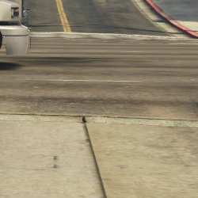 | 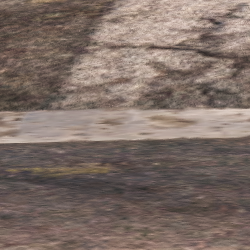 |

| CS Label 1 | CS Label 2 | GTA Label 1 | GTA Label 2 |
|-----------|-----------|-----------|-----------|
|  |  | 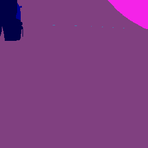 |  |
<!-- 
**Samples 3-4:**
| CS Image 3 | CS Image 4 | GTA Image 3 | GTA Image 4 |
|-----------|-----------|-----------|-----------|
|  |  | 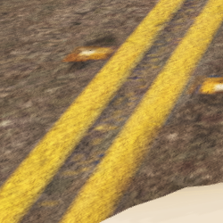 | 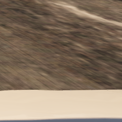 |

| CS Label 3 | CS Label 4 | GTA Label 3 | GTA Label 4 |
|-----------|-----------|-----------|-----------|
|  |  |  |  | -->

### 2. Sidewalk
| Metric | Cityscapes | GTA-5 |
|---|---:|---:|
| Representativity | 6.09% | 9.33% |
| IoU | 74.01 | 87.35 |
| Accuracy | 80.26% | 94.35% |
| Error | 19.74% | 5.65% |
| Confused Classes (Top 3) | road (15.37%) building (1.27%) vegetation (0.61%) | road (3.11%) terrain (1.20%) building (0.45%) |
<!-- | Mean Representation (V2) | 5.7263% | 9.5300% |
| Mean Error (V2) | 28.5589% | 13.6400% | -->
 
_Commentary: Sidewalk exhibits a large domain gap—Cityscapes error is much higher than GTA-5—indicating sensitivity to curb appearance and small-scale geometry; most confusions are with Road near boundaries. Moreover, in Cityscapes there are cases where cars overlap sidewalks, and the model sometimes classifies those sidewalk pixels as road._

**Samples 1-2:**
| CS Image 1 | CS Image 2 | GTA Image 1 | GTA Image 2 |
|-----------|-----------|-----------|----------|
|  | 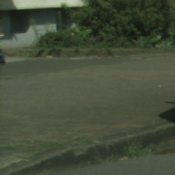 | 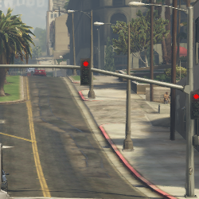 | 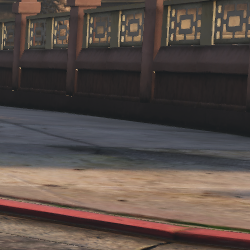 |

| CS Label 1 | CS Label 2 | GTA Label 1 | GTA Label 2 |
|-----------|-----------|-----------|----------|
|  |  | 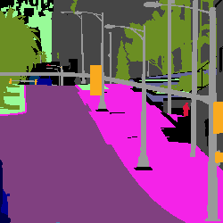 | 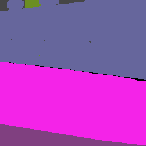 |
<!-- 
**Samples 3-4:**
| CS Image 3 | CS Image 4 | GTA Image 3 | GTA Image 4 |
|-----------|-----------|-----------|----------|
|  |  | 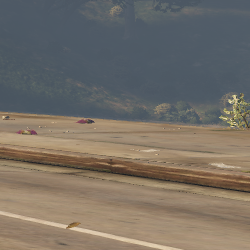 | 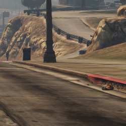 |

| CS Label 3 | CS Label 4 | GTA Label 3 | GTA Label 4 |
|-----------|-----------|-----------|----------|
|  |  | 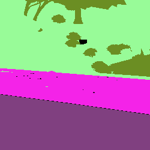 | 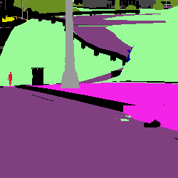 | -->

### 3. Building
| Metric | Cityscapes | GTA-5 |
|---|---:|---:|
| Representativity | 22.82% | 19.03% |
| IoU | 89.47 | 90.20 |
| Accuracy | 94.83% | 95.56% |
| Error | 5.17% | 4.44% |
| Confused Classes (Top 3) | vegetation (2.67%) pole (0.54%) sky (0.38%) | vegetation (1.51%) wall (0.86%) sky (0.49%) |
<!-- | Mean Representation (V2) | 22.8292% | 17.8000% |
| Mean Error (V2) | 8.3011% | 10.7800% | -->
 
_Commentary: Building is a high-support class with strong performance in both domains; remaining errors are small and mostly involve vegetation or thin vertical elements like poles._

**Samples 1-2:**
| CS Image 1 | CS Image 2 | GTA Image 1 | GTA Image 2 |
|-----------|-----------|-----------|----------|
| 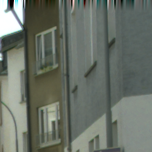 | 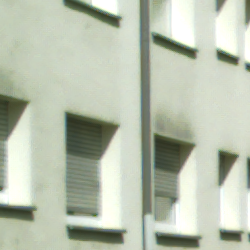 | 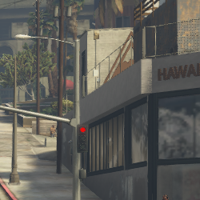 | 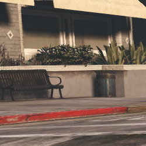 |

| CS Label 1 | CS Label 2 | GTA Label 1 | GTA Label 2 |
|-----------|-----------|-----------|----------|
| 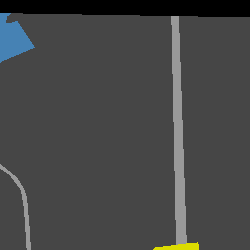 |  | 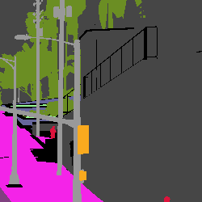 | 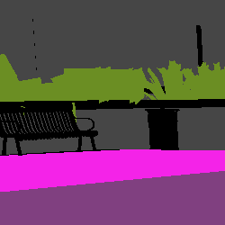 |
<!-- 
**Samples 3-4:**
| CS Image 3 | CS Image 4 | GTA Image 3 | GTA Image 4 |
|-----------|-----------|-----------|----------|
|  |  | 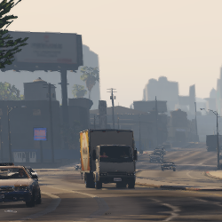 | 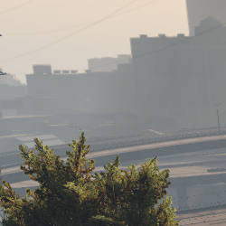 |

| CS Label 3 | CS Label 4 | GTA Label 3 | GTA Label 4 |
|-----------|-----------|-----------|----------|
| 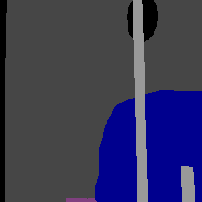 |  | 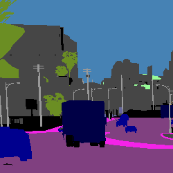 | 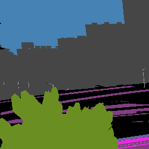 | -->

### 4. Wall
| Metric | Cityscapes | GTA-5 |
|---|---:|---:|
| Representativity | 0.66% | 2.08% |
| IoU | 53.35 | 66.25 |
| Accuracy | 63.75% | 76.88% |
| Error | 36.25% | 23.12% |
| Confused Classes (Top 3) | building (19.00%) fence (6.51%) vegetation (5.08%) | building (12.86%) sidewalk (3.24%) vegetation (2.41%) |
<!-- | Mean Representation (V2) | 2.0115% | 1.9400% |
| Mean Error (V2) | 69.2165% | 55.0700% | -->
 
_Commentary: Wall is a rare class with high error, commonly absorbed into Building; visual similarity and low occurrence make it a weak spot for the model._

**Samples 1-2:**
| CS Image 1 | CS Image 2 | GTA Image 1 | GTA Image 2 |
|-----------|-----------|-----------|----------|
| 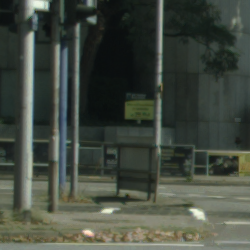 |  | 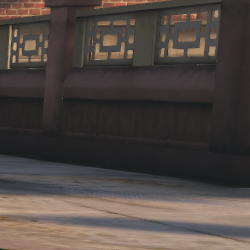 | 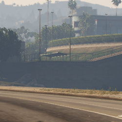 |

| CS Label 1 | CS Label 2 | GTA Label 1 | GTA Label 2 |
|-----------|-----------|-----------|----------|
| 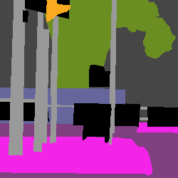 |  | 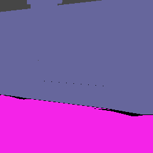 | 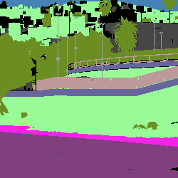 |
<!-- 
**Samples 3-4:**
| CS Image 3 | CS Image 4 | GTA Image 3 | GTA Image 4 |
|-----------|-----------|-----------|----------|
| 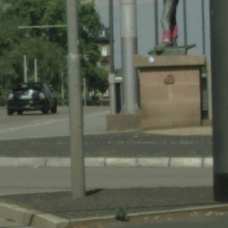 |  | 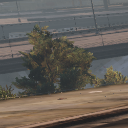 | 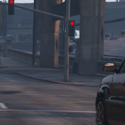 |

| CS Label 3 | CS Label 4 | GTA Label 3 | GTA Label 4 |
|-----------|-----------|-----------|----------|
|  | 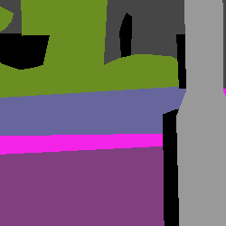 | 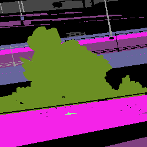 | 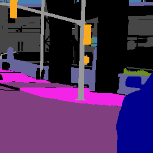 | -->

### 5. Fence

| Metric | Cityscapes | GTA-5 |
|---|---:|---:|
| Representativity | 0.88% | 0.71% |
| IoU | 47.72 | 61.83 |
| Accuracy | 56.93% | 74.38% |
| Error | 43.07% | 25.62% |
| Confused Classes (Top 3) | building (22.75%) vegetation (6.00%) pole (2.72%) | building (12.56%) vegetation (4.88%) wall (3.30%) |
<!-- | Mean Representation (V2) | 2.1956% | 1.0600% |
| Mean Error (V2) | 62.1267% | 78.0200% | -->
 
_Commentary: Fence suffers from high error (especially in Cityscapes) and is frequently predicted as Building or Vegetation; its thin, repeating structure is challenging for the segmentation model._

**Samples 1-2:**
| CS Image 1 | CS Image 2 | GTA Image 1 | GTA Image 2 |
|-----------|-----------|-----------|----------|
| 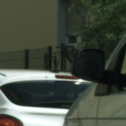 | 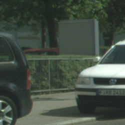 | 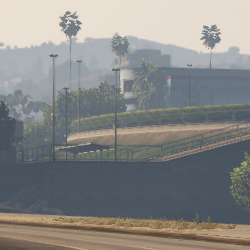 | 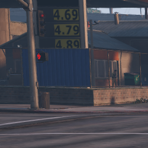 |

| CS Label 1 | CS Label 2 | GTA Label 1 | GTA Label 2 |
|-----------|-----------|-----------|----------|
| 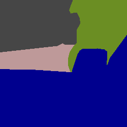 |  | 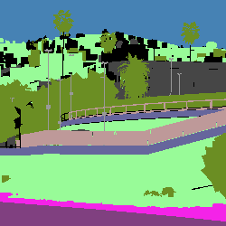 | 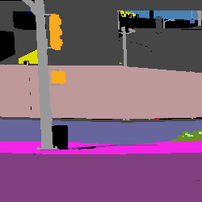 |
<!-- 
**Samples 3-4:**
| CS Image 3 | CS Image 4 | GTA Image 3 | GTA Image 4 |
|-----------|-----------|-----------|----------|
|  |  | 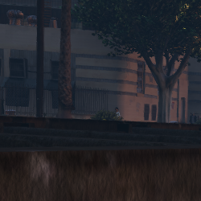 |  |

| CS Label 3 | CS Label 4 | GTA Label 3 | GTA Label 4 |
|-----------|-----------|-----------|----------|
|  |  |  |  | -->

### 6. Pole
| Metric | Cityscapes | GTA-5 |
|---|---:|---:|
| Representativity | 1.23% | 1.19% |
| IoU | 50.64 | 59.61 |
| Accuracy | 61.25% | 76.44% |
| Error | 38.75% | 23.56% |
| Confused Classes (Top 3) | building (19.59%) vegetation (8.23%) person (1.59%) | building (13.45%) vegetation (6.01%) sky (4.68%) |
<!-- | Mean Representation (V2) | 1.5232% | 1.2200% |
| Mean Error (V2) | 46.1257% | 43.5400% | -->
 
_Commentary: Pole is a prototypical thin-structure failure: high error and frequent confusion with building or vegetation, reflecting limited shape support and occlusion sensitivity._

**Samples 1-2:**
| CS Image 1 | CS Image 2 | GTA Image 1 | GTA Image 2 |
|-----------|-----------|-----------|----------|
|  |  |  |  |

| CS Label 1 | CS Label 2 | GTA Label 1 | GTA Label 2 |
|-----------|-----------|-----------|----------|
|  |  |  |  |
<!-- 
**Samples 3-4:**
| CS Image 3 | CS Image 4 | GTA Image 3 | GTA Image 4 |
|-----------|-----------|-----------|----------|
|  |  |  |  |

| CS Label 3 | CS Label 4 | GTA Label 3 | GTA Label 4 |
|-----------|-----------|-----------|----------|
|  |  |  |  | -->

### 7. Traffic Light
| Metric | Cityscapes | GTA-5 |
|---|---:|---:|
| Representativity | 0.21% | 0.15% |
| IoU | 54.72 | 61.42 |
| Accuracy | 71.23% | 69.89% |
| Error | 28.77% | 30.11% |
| Confused Classes (Top 3) | building (12.83%) vegetation (9.80%) pole (3.52%) | building (13.26%) pole (7.75%) vegetation (5.49%) |
<!-- | Mean Representation (V2) | 0.3398% | 0.2100% |
| Mean Error (V2) | 55.9699% | 62.1300% | -->

_Commentary: Traffic lights are small and reflective, yielding high error rates and frequent confusion with building or vegetation; lighting and occlusion likely worsen performance._

**Samples 1-2:**
| CS Image 1 | CS Image 2 | GTA Image 1 | GTA Image 2 |
|-----------|-----------|-----------|----------|
|  |  |  |  |

| CS Label 1 | CS Label 2 | GTA Label 1 | GTA Label 2 |
|-----------|-----------|-----------|----------|
|  |  |  |  |
<!-- 
**Samples 3-4:**
| CS Image 3 | CS Image 4 | GTA Image 3 | GTA Image 4 |
|-----------|-----------|-----------|----------|
|  |  |  |  |

| CS Label 3 | CS Label 4 | GTA Label 3 | GTA Label 4 |
|-----------|-----------|-----------|----------|
|  |  |  |  | -->

### 8. Traffic Sign
| Metric | Cityscapes | GTA-5 |
|---|---:|---:|
| Representativity | 0.55% | 0.09% |
| IoU | 63.57 | 72.18 |
| Accuracy | 73.51% | 79.89% |
| Error | 26.49% | 20.11% |
| Confused Classes (Top 3) | building (14.16%) vegetation (3.82%) pole (2.10%) | building (10.24%) vegetation (3.53%) sky (1.49%) |
<!-- | Mean Representation (V2) | 0.7110% | 0.1700% |
| Mean Error (V2) | 37.4443% | 71.4600% | -->

_Commentary: Traffic signs perform moderately better in GTA-5; in Cityscapes they are often merged into building/vegetation due to small size and contextual ambiguity._

**Samples 1-2:**
| CS Image 1 | CS Image 2 | GTA Image 1 | GTA Image 2 |
|-----------|-----------|-----------|----------|
|  |  |  |  |

| CS Label 1 | CS Label 2 | GTA Label 1 | GTA Label 2 |
|-----------|-----------|-----------|----------|
|  |  |  |  |
<!-- 
**Samples 3-4:**
| CS Image 3 | CS Image 4 | GTA Image 3 | GTA Image 4 |
|-----------|-----------|-----------|----------|
|  |  |  |  |

| CS Label 3 | CS Label 4 | GTA Label 3 | GTA Label 4 |
|-----------|-----------|-----------|----------|
|  |  |  |  | -->

### 9. Vegetation
| Metric | Cityscapes | GTA-5 |
|---|---:|---:|
| Representativity | 15.92% | 8.55% |
| IoU | 89.97 | 84.14 |
| Accuracy | 96.08% | 91.88% |
| Error | 3.92% | 8.12% |
| Confused Classes (Top 3) | building (1.70%) sky (0.73%) pole (0.44%) | building (3.54%) terrain (1.50%) sky (1.35%) |
<!-- | Mean Representation (V2) | 17.8024% | 8.4100% |
| Mean Error (V2) | 5.7141% | 13.4100% | -->

_Commentary: Vegetation is a robust class in Cityscapes but shows higher error in GTA-5, suggesting texture or label differences across domains drive some confusion._

**Samples 1-2:**
| CS Image 1 | CS Image 2 | GTA Image 1 | GTA Image 2 |
|-----------|-----------|-----------|----------|
|  |  |  |  |

| CS Label 1 | CS Label 2 | GTA Label 1 | GTA Label 2 |
|-----------|-----------|-----------|----------|
|  |  |  |  |
<!-- 
**Samples 3-4:**
| CS Image 3 | CS Image 4 | GTA Image 3 | GTA Image 4 |
|-----------|-----------|-----------|----------|
|  |  |  |  |

| CS Label 3 | CS Label 4 | GTA Label 3 | GTA Label 4 |
|-----------|-----------|-----------|----------|
|  |  |  |  | -->

### 10. Terrain
| Metric | Cityscapes | GTA-5 |
|---|---:|---:|
| Representativity | 1.16% | 2.41% |
| IoU | 44.36 | 75.11 |
| Accuracy | 47.07% | 85.44% |
| Error | 52.93% | 14.56% |
| Confused Classes (Top 3) | vegetation (23.71%) sidewalk (19.74%) wall (3.70%) | sidewalk (4.57%) vegetation (3.55%) road (1.77%) |
<!-- | Mean Representation (V2) | 1.7053% | 2.8400% |
| Mean Error (V2) | 73.2923% | 46.5800% | -->

_Commentary: Terrain shows a large domain gap—very high error in Cityscapes—often confused with vegetation or sidewalk; inconsistent labeling or rarity likely explain the discrepancy._

**Samples 1-2:**
| CS Image 1 | CS Image 2 | GTA Image 1 | GTA Image 2 |
|-----------|-----------|-----------|----------|
|  |  |  |  |

| CS Label 1 | CS Label 2 | GTA Label 1 | GTA Label 2 |
|-----------|-----------|-----------|----------|
|  |  |  |  |
<!-- 
**Samples 3-4:**
| CS Image 3 | CS Image 4 | GTA Image 3 | GTA Image 4 |
|-----------|-----------|-----------|----------|
|  |  |  |  |

| CS Label 3 | CS Label 4 | GTA Label 3 | GTA Label 4 |
|-----------|-----------|-----------|----------|
|  |  |  |  | -->

### 11. Sky
| Metric | Cityscapes | GTA-5 |
|---|---:|---:|
| Representativity | 4.01% | 15.23% |
| IoU | 92.56 | 96.28 |
| Accuracy | 98.75% | 98.07% |
| Error | 1.25% | 1.93% |
| Confused Classes (Top 3) | building (0.50%) vegetation (0.46%) pole (0.22%) | vegetation (1.14%) building (0.40%) pole (0.23%) |
<!-- | Mean Representation (V2) | 3.7178% | 16.3400% |
| Mean Error (V2) | 5.7275% | 4.0900% | -->

_Commentary: Sky is reliably predicted in both domains, with very low error; GTA-5 contains more sky area, but the model handles broad, homogeneous regions well. Moreover, in GTA sample 1 there appears to be an annotation error._

**Samples 1-2:**
| CS Image 1 | CS Image 2 | GTA Image 1 | GTA Image 2 |
|-----------|-----------|-----------|----------|
|  |  |  |  |

| CS Label 1 | CS Label 2 | GTA Label 1 | GTA Label 2 |
|-----------|-----------|-----------|----------|
|  |  |  |  |
<!-- 
**Samples 3-4:**
| CS Image 3 | CS Image 4 | GTA Image 3 | GTA Image 4 |
|-----------|-----------|-----------|----------|
|  |  |  |  |

| CS Label 3 | CS Label 4 | GTA Label 3 | GTA Label 4 |
|-----------|-----------|-----------|----------|
|  |  |  |  | -->

### 12. Person
| Metric | Cityscapes | GTA-5 |
|---|---:|---:|
| Representativity | 1.22% | 0.41% |
| IoU | 71.79 | 74.01 |
| Accuracy | 84.35% | 92.09% |
| Error | 15.65% | 7.91% |
| Confused Classes (Top 3) | building (4.67%) rider (3.93%) bicycle (1.64%) | building (6.14%) sidewalk (2.83%) vegetation (2.42%) |
<!-- | Mean Representation (V2) | 1.6319% | 0.4000% |
| Mean Error (V2) | 38.2510% | 62.5200% | -->

_Commentary: Person detection is better in GTA-5 than Cityscapes; errors in Cityscapes often come from occlusion or grouping (people near buildings or riders), indicating scale and pose variability challenges._

**Samples 1-2:**
| CS Image 1 | CS Image 2 | GTA Image 1 | GTA Image 2 |
|-----------|-----------|-----------|----------|
|  |  |  |  |

| CS Label 1 | CS Label 2 | GTA Label 1 | GTA Label 2 |
|-----------|-----------|-----------|----------|
|  |  |  |  |
<!-- 
**Samples 3-4:**
| CS Image 3 | CS Image 4 | GTA Image 3 | GTA Image 4 |
|-----------|-----------|-----------|----------|
|  |  |  |  |

| CS Label 3 | CS Label 4 | GTA Label 3 | GTA Label 4 |
|-----------|-----------|-----------|----------|
|  |  |  |  | -->

### 13. Rider
| Metric | Cityscapes | GTA-5 |
|---|---:|---:|
| Representativity | 0.13% | 0.03% |
| IoU | 44.77 | 70.29 |
| Accuracy | 65.63% | 87.06% |
| Error | 34.37% | 12.94% |
| Confused Classes (Top 3) | person (15.03%) bicycle (8.62%) building (2.84%) | motorcycle (4.17%) car (2.24%) bicycle (1.25%) |
<!-- | Mean Representation (V2) | 0.4197% | 0.2900% |
| Mean Error (V2) | 59.5764% | 68.2500% | -->

_Commentary: Rider is rare and hard to predict in Cityscapes, often confused with person or bicycle; GTA-5 shows a clearer appearance for riders, improving performance there._

**Samples 1-2:**
| CS Image 1 | CS Image 2 | GTA Image 1 | GTA Image 2 |
|-----------|-----------|-----------|----------|
|  |  |  |  |

| CS Label 1 | CS Label 2 | GTA Label 1 | GTA Label 2 |
|-----------|-----------|-----------|----------|
|  |  |  |  |
<!-- 
**Samples 3-4:**
| CS Image 3 | CS Image 4 | GTA Image 3 | GTA Image 4 |
|-----------|-----------|-----------|----------|
|  |  |  |  |

| CS Label 3 | CS Label 4 | GTA Label 3 | GTA Label 4 |
|-----------|-----------|-----------|----------|
|  |  |  |  | -->

### 14. Car
| Metric | Cityscapes | GTA-5 |
|---|---:|---:|
| Representativity | 7.00% | 2.83% |
| IoU | 92.58 | 91.82 |
| Accuracy | 95.46% | 96.44% |
| Error | 4.54% | 3.56% |
| Confused Classes (Top 3) | road (1.43%) building (1.03%) vegetation (0.59%) | road (1.14%) truck (0.71%) building (0.58%) |
<!-- | Mean Representation (V2) | 6.7903% | 3.4800% |
| Mean Error (V2) | 10.5351% | 17.0000% | -->

_Commentary: Car detection is strong in both domains; the remaining confusions are minor and mainly involve road or other large, nearby classes._

**Samples 1-2:**
| CS Image 1 | CS Image 2 | GTA Image 1 | GTA Image 2 |
|-----------|-----------|-----------|----------|
|  |  |  |  |

| CS Label 1 | CS Label 2 | GTA Label 1 | GTA Label 2 |
|-----------|-----------|-----------|----------|
|  |  |  |  |
<!-- 
**Samples 3-4:**
| CS Image 3 | CS Image 4 | GTA Image 3 | GTA Image 4 |
|-----------|-----------|-----------|----------|
|  |  |  |  |

| CS Label 3 | CS Label 4 | GTA Label 3 | GTA Label 4 |
|-----------|-----------|-----------|----------|
|  |  |  |  | -->

### 15. Truck
| Metric | Cityscapes | GTA-5 |
|---|---:|---:|
| Representativity | 0.27% | 1.27% |
| IoU | 77.82 | 88.66 |
| Accuracy | 89.23% | 94.33% |
| Error | 10.77% | 5.67% |
| Confused Classes (Top 3) | building (3.95%) car (3.60%) vegetation (1.01%) | car (1.69%) building (1.61%) bus (0.82%) |
<!-- | Mean Representation (V2) | 1.8715% | 1.8600% |
| Mean Error (V2) | 55.9622% | 49.0500% | -->

_Commentary: Truck is relatively uncommon but better represented in GTA-5; lower error in GTA suggests more consistent appearance and fewer occlusions compared to Cityscapes._

**Samples 1-2:**
| CS Image 1 | CS Image 2 | GTA Image 1 | GTA Image 2 |
|-----------|-----------|-----------|----------|
|  |  |  |  |

| CS Label 1 | CS Label 2 | GTA Label 1 | GTA Label 2 |
|-----------|-----------|-----------|----------|
|  |  |  |  |
<!-- 
**Samples 3-4:**
| CS Image 3 | CS Image 4 | GTA Image 3 | GTA Image 4 |
|-----------|-----------|-----------|----------|
|  |  |  |  |

| CS Label 3 | CS Label 4 | GTA Label 3 | GTA Label 4 |
|-----------|-----------|-----------|----------|
|  |  |  |  | -->

### 16. Bus
| Metric | Cityscapes | GTA-5 |
|---|---:|---:|
| Representativity | 0.24% | 0.41% |
| IoU | 80.63 | 90.47 |
| Accuracy | 86.72% | 95.70% |
| Error | 13.28% | 4.30% |
| Confused Classes (Top 3) | building (3.29%) train (2.96%) vegetation (1.95%) | truck (0.87%) building (0.75%) car (0.72%) |
<!-- | Mean Representation (V2) | 2.5394% | 1.4100% |
| Mean Error (V2) | 42.8211% | 70.0100% | -->

_Commentary: Bus shows a substantial domain effect with much lower error in GTA-5—likely due to clearer, larger instances in the synthetic data._

**Samples 1-2:**
| CS Image 1 | CS Image 2 | GTA Image 1 | GTA Image 2 |
|-----------|-----------|-----------|----------|
|  |  |  |  |

| CS Label 1 | CS Label 2 | GTA Label 1 | GTA Label 2 |
|-----------|-----------|-----------|----------|
|  |  |  |  |
<!-- 
**Samples 3-4:**
| CS Image 3 | CS Image 4 | GTA Image 3 | GTA Image 4 |
|-----------|-----------|-----------|----------|
|  |  |  |  |

| CS Label 3 | CS Label 4 | GTA Label 3 | GTA Label 4 |
|-----------|-----------|-----------|----------|
|  |  |  |  | -->

### 17. Train
| Metric | Cityscapes | GTA-5 |
|---|---:|---:|
| Representativity | 0.23% | 0.07% |
| IoU | 63.59 | 85.63 |
| Accuracy | 80.42% | 90.73% |
| Error | 19.58% | 9.27% |
| Confused Classes (Top 3) | building (7.98%) bus (5.68%) vegetation (2.43%) | building (4.05%) wall (1.58%) pole (1.32%) |
<!-- | Mean Representation (V2) | 2.6477% | 1.0000% |
| Mean Error (V2) | 52.1313% | 81.9400% | -->

_Commentary: Train is rare and often confused with building or bus in Cityscapes; GTA-5 shows better separation, possibly due to clearer train appearances in the synthetic set._

**Samples 1-2:**
| CS Image 1 | CS Image 2 | GTA Image 1 | GTA Image 2 |
|-----------|-----------|-----------|----------|
|  |  |  |  |

| CS Label 1 | CS Label 2 | GTA Label 1 | GTA Label 2 |
|-----------|-----------|-----------|----------|
|  |  |  |  |
<!-- 
**Samples 3-4:**
| CS Image 3 | CS Image 4 | GTA Image 3 | GTA Image 4 |
|-----------|-----------|-----------|----------|
|  |  |  |  |

| CS Label 3 | CS Label 4 | GTA Label 3 | GTA Label 4 |
|-----------|-----------|-----------|----------|
|  |  |  |  | -->

### 18. Motorcycle
| Metric | Cityscapes | GTA-5 |
|---|---:|---:|
| Representativity | 0.10% | 0.04% |
| IoU | 56.66 | 81.45 |
| Accuracy | 74.49% | 88.48% |
| Error | 25.51% | 11.52% |
| Confused Classes (Top 3) | bicycle (8.60%) car (4.69%) rider (3.07%) | car (4.84%) rider (3.31%) road (1.87%) |
<!-- | Mean Representation (V2) | 0.4304% | 0.2100% |
| Mean Error (V2) | 65.6538% | 80.1300% | -->

_Commentary: Motorcycle is small and infrequent, leading to substantial error in Cityscapes; common confusions are with bicycle and car, reflecting scale and pose ambiguity._

**Samples 1-2:**
| CS Image 1 | CS Image 2 | GTA Image 1 | GTA Image 2 |
|-----------|-----------|-----------|----------|
|  |  |  |  |

| CS Label 1 | CS Label 2 | GTA Label 1 | GTA Label 2 |
|-----------|-----------|-----------|----------|
|  |  |  |  |
<!-- 
**Samples 3-4:**
| CS Image 3 | CS Image 4 | GTA Image 3 | GTA Image 4 |
|-----------|-----------|-----------|----------|
|  |  |  |  |

| CS Label 3 | CS Label 4 | GTA Label 3 | GTA Label 4 |
|-----------|-----------|-----------|----------|
|  |  |  |  | -->

### 19. Bicycle

This class is better represented in Cityscapes dataset (showing a better performance), however there exist a mismatch in the labels because in Cityscapes the pixels inside the wheels are also classified as Bicycle while in GTA-5 only the wheels and the frame of the Bicycle take into account.

| Metric | Cityscapes | GTA-5 |
|---|---:|---:|
| Representativity | 0.41% | 0.01% |
| IoU | 63.40 | 56.20 |
| Accuracy | 79.10% | 82.16% |
| Error | 20.90% | 17.84% |
| Confused Classes (Top 3) | road (4.65%) rider (4.13%) sidewalk (2.56%) | road (6.29%) rider (5.47%) terrain (2.66%) |
<!-- | Mean Representation (V2) | 1.0097% | 0.2500% |
| Mean Error (V2) | 40.7554% | 54.5800% | -->

_Commentary: Bicycle performance is impacted by label and annotation mismatches between datasets; differences in what pixels are included (wheels/frame) explain part of the domain gap and make direct comparison noisy._

**Samples 1-2:**
| CS Image 1 | CS Image 2 | GTA Image 1 | GTA Image 2 |
|-----------|-----------|-----------|----------|
|  |  |  |  |

| CS Label 1 | CS Label 2 | GTA Label 1 | GTA Label 2 |
|-----------|-----------|-----------|----------|
|  |  |  |  |
<!-- 
**Samples 3-4:**
| CS Image 3 | CS Image 4 | GTA Image 3 | GTA Image 4 |
|-----------|-----------|-----------|----------|
|  |  |  |  |

| CS Label 3 | CS Label 4 | GTA Label 3 | GTA Label 4 |
|-----------|-----------|-----------|----------|
|  |  |  |  | -->

## Error vs Scale by Class

The following plot shows error versus object scale (number of pixels) and the scale distributions for each class.

In general, error rate falls sharply with object pixel area: small instances (under ~1,000 pixels) show near-total failure, while performance improves rapidly past this threshold. Curves for rare classes (train, bus, truck) are noisy due to few samples. Car performance is stable and shows low error across instance sizes.

 

## Confusion matrix

### Cityscapes (predictions over Cityscapes Validation Set)

The following plot shows the most confused classes. Wall, Fence, Pole, Traffic Light and Traffic Sign are often confused with Building. Terrain is confused with Sidewalk and Vegetation, and Rider with Person.

 

### GTA-5 (Predictions over the subset of GTA-5)

Similarly, the classes Wall, Fence, Pole, Traffic Light and Traffic Sign are confused with Building. However, the confusion between Sidewalk and Road is much lower than in Cityscapes.

